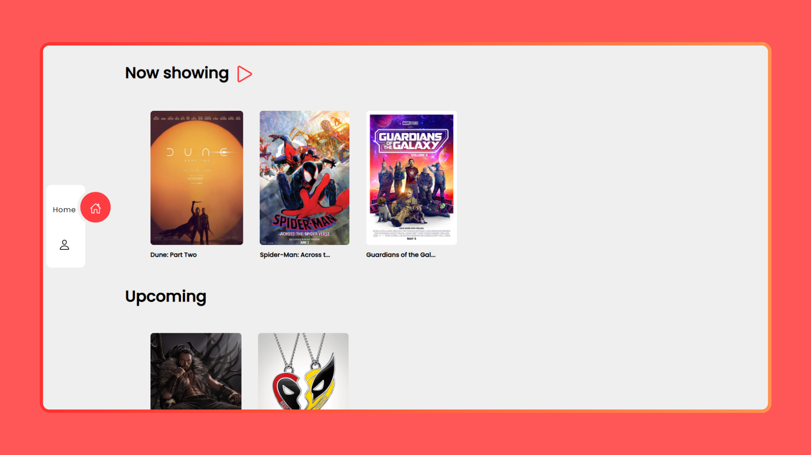
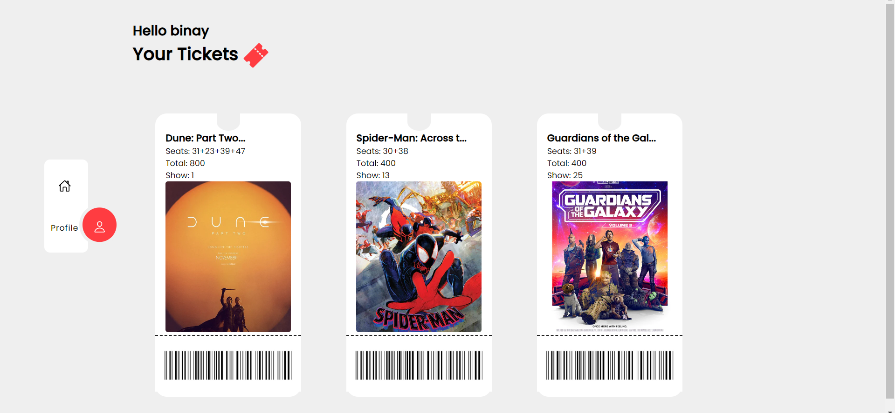
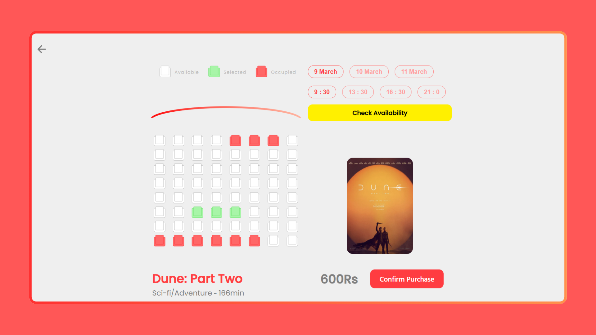

# 🎬 Movie Booking Website

A full-stack movie booking web application that allows users to browse movies, view details, and book tickets with ease. Built using modern web technologies and connected to a MySQL database for persistent data handling.

---

## 🚀 Features

- 🔍 Browse and search movies
- 🗓 View movie details, showtimes, and availability
- 🎟 Book tickets and view booking history
- 💾 MySQL-backed database for persistent storage

---

## 🛠 Tech Stack

- **Frontend**: HTML, CSS, JavaScript
- **Backend**: MySQL Database
- **Database**: MySQL (configured via MySQL Workbench)
- **Tools**: MySQL Workbench

---

# 📸 Screenshots

Visual walkthrough of the **Movie Booking Website**.

---

### 🏠 Home Page

The homepage displays a list of available movies with posters, titles, and a search bar.

---

### 🎬 Movie Details

User booked Tickets with deatils.

---

### 🗓️ Booking Screen

Users can select a showtime, choose seats, and confirm their ticket booking.

---

> 📁 All images are stored in the `/screenshots` folder.
